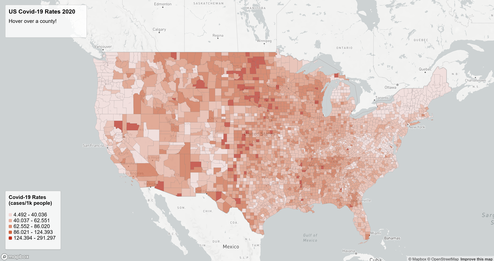
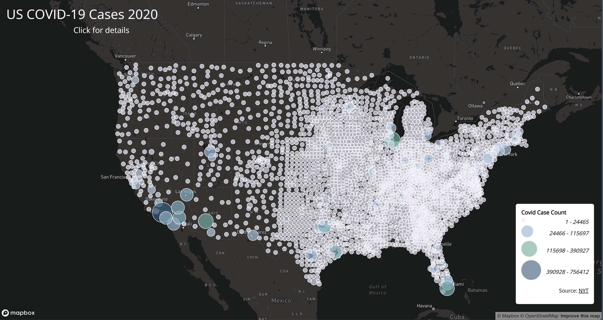

# US COVID-19 2020 Maps

#### About
This project maps the US Covid-19 rates and case counts by county in the year 2020. Covid rates are mapped with a chloropleth map, while Covid case counts are mapped with proportional symbols.
#### [Chloropleth Map](https://emrichert.github.io/US2020Covid/map1.html)

#### [Proportional Symbol Map](https://emrichert.github.io/US2020Covid/map2.html)

#### Primary Function
The chloropleth map allows the user to hover over a county to get the name of the county (and its state) with their respective Covid-19 rate (out of 1000 people). The 5 classes are natural breaks and ArcGIS was used to get the specific break values.

The proportional symbol map allows the user to click on a dot to get the name of the county, state, and its respective covid-19 case count. Natural breaks and 4 classes were used to best utilize the different dot sizes and colors without them being indistinguishable from each other.

#### Libraries in use
* Mapbox GL JS for map style. 
* Google Fonts library - Open Sans and Oswald

#### Data Sources
The COVID-19 numbers come from [New York Times'](https://github.com/nytimes/covid-19-data/blob/43d32dde2f87bd4dafbb7d23f5d9e878124018b8/live/us-counties.csv) COVID-19 data that includes all of the 2020 cases.
Rates were calculated using the [2018 ACS 5-year estimates](https://data.census.gov/table/ACSDP5Y2018.DP05?g=0100000US$050000&d=ACS+5-Year+Estimates+Data+Profiles).

#### Credit
US county boundary shapefile downloaded from the [US Census Bureau](https://www.census.gov/geographies/mapping-files/time-series/geo/carto-boundary-file.html).

